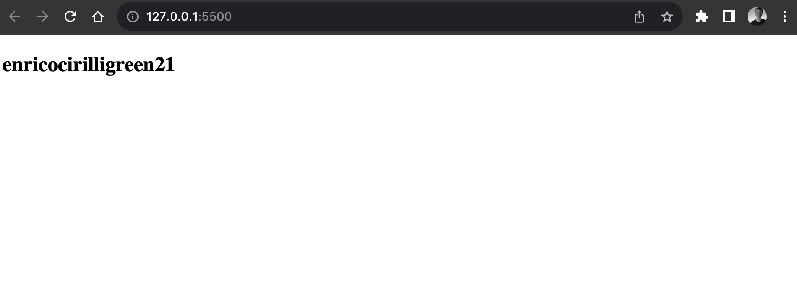

### Esercizio di oggi: (insicurissimo) password generator
#### Raccolta Dati
1.Chiedi all’utente il suo nome,

2.chiedi il suo cognome,

3.chiedi il suo colore preferito,

4.scrivi sulla pagina nomecognomecolorepreferito21.

#### Logica del Programma
1.const userName=prompt("Hello User! what's your Name?");

2.console.log(userName, 'type userName');

3.const userSurname=prompt("Hello User! what's your Surname?");

4.console.log(userSurname, 'type userSurname');

5.const userFavoriteColor=prompt("Hello User! what's your favorite color?");

6.console.log(userFavoriteColor, 'type userFavoriteColor');

7.const resultMessage=`${userName}${userSurname}${userFavoriteColor}21`;

8.console.log(resultMessage);

#### Ouput del Messaggio
document.getElementById("result").innerHTML = resultMessage;

